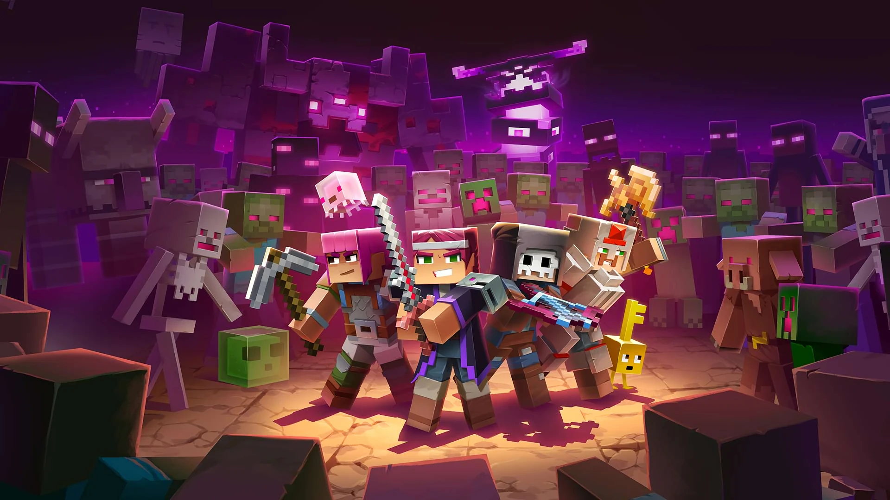

<div align="center">
  
  
  <h1>NovaCL</h1>
  
  <p align="center">
    <strong>现代化的 Minecraft 客户端启动器</strong>
  </p>
  
  <p align="center">
    <a href="#features">✨ 特性</a>
    •
    <a href="#tech-stack">🚀 技术栈</a>
    •
    <a href="#installation">📦 安装</a>
    •
    <a href="#usage">💡 使用</a>
    •
    <a href="#development">🛠️ 开发</a>
    •
    <a href="#license">📄 许可证</a>
  </p>
  
  <div align="center">
    
    
    
    
    
  </div>
</div>

---

## 📖 项目介绍

NovaCL 是一个现代化的 Minecraft 客户端启动器，专为 Minecraft 玩家设计，提供便捷的资源搜索、下载和管理功能。通过简洁直观的界面，玩家可以快速浏览、安装和更新各种模组、材质包及版本，同时支持多实例管理，让游戏体验更加顺畅和个性化。

## ✨ 特性

- 🔍 **资源搜索** - 支持 Modrinth 资源搜索
- 📥 **一键下载** - 便捷的资源下载功能
- 📦 **版本管理** - 支持多版本资源管理
- 🎨 **现代 UI** - 采用现代化的界面设计
- 🌙 **暗黑模式** - 支持明暗主题切换
- ⚡ **高性能** - 基于 Tauri 构建，性能优异
- 📱 **跨平台** - 支持 Windows、macOS 和 Linux

## 🚀 技术栈

| 技术        | 版本   | 用途               |
| ----------- | ------ | ------------------ |
| Vue.js      | 3.5.13 | 前端框架           |
| TypeScript  | 5.8.3  | 类型安全           |
| Tauri       | 2      | 跨平台桌面应用框架 |
| Rust        | 1.70+  | 后端开发           |
| TailwindCSS | 4.1.4  | CSS 框架           |
| DaisyUI     | 5.0.27 | UI 组件库          |
| Pinia       | 3.0.2  | 状态管理           |
| Vue Router  | 4.5.1  | 路由管理           |
| Vite        | 6.3.4  | 构建工具           |

## 📦 安装

### 预构建版本

访问 [Releases](https://github.com/NEXORA-Studios/Nova.CL/releases) 页面下载最新版本。

### 从源代码构建

#### 前置要求

- [Node.js](https://nodejs.org/) 18+
- [Rust](https://www.rust-lang.org/) 1.70+
- [pnpm](https://pnpm.io/) 或 [bun](https://bun.sh/)（推荐）

#### 构建步骤

```bash
# 克隆仓库
git clone https://github.com/NEXORA-Studios/Nova.CL.git
cd Nova.CL

# 安装依赖
bun install

# 构建应用
bun run tauri build
```

构建完成后，可执行文件将位于 `src-tauri/target/release/` 目录下。

## 💡 使用

1. 启动 NovaCL 应用
2. 在搜索框中输入您想要查找的资源名称
3. 浏览搜索结果，点击进入资源详情页
4. 选择合适的版本，点击下载按钮
5. 下载完成后，资源将被保存到指定目录

## 🛠️ 开发

### 开发环境设置

```bash
# 安装依赖
bun install

# 启动开发服务器
bun run tauri dev
```

### 项目结构

```
Nova.CL/
├── public/              # 静态资源
├── src/                 # Vue 前端代码
│   ├── assets/          # 前端资源
│   ├── components/      # Vue 组件
│   ├── composables/     # 组合式函数
│   ├── layout/          # 布局组件
│   ├── modules/         # 模块
│   ├── pages/           # 页面组件
│   ├── types/           # TypeScript 类型定义
│   ├── utils/           # 工具函数
│   ├── App.vue          # 根组件
│   └── main.ts          # 入口文件
├── src-tauri/           # Tauri 后端代码
│   ├── capabilities/    # 权限配置
│   ├── icons/           # 应用图标
│   ├── src/             # Rust 源代码
│   ├── Cargo.toml       # Rust 依赖配置
│   └── tauri.conf.json  # Tauri 配置文件
├── package.json         # Node.js 依赖配置
├── tsconfig.json        # TypeScript 配置
└── vite.config.ts       # Vite 配置
```

## 🤝 贡献

欢迎提交 Issues 和 Pull Requests！

## 📄 许可证

### 项目开源许可证

本项目采用 AGPL 3.0 许可证 - 查看 [LICENSE](LICENSE) 文件了解详情。

### 最终用户许可协议 (EULA)

使用 NovaCL 应用程序即表示您同意遵守我们的 [最终用户许可协议](docs/EULA.md)。

### 隐私政策

我们重视您的隐私，详情请查看 [隐私政策](docs/PRIVACY_POLICY.md)。

## 📞 联系方式

- 项目地址：[https://github.com/NEXORA-Studios/Nova.CL](https://github.com/NEXORA-Studios/Nova.CL)
- Issues：[https://github.com/NEXORA-Studios/Nova.CL/issues](https://github.com/NEXORA-Studios/Nova.CL/issues)

## 🙏 致谢

感谢所有为本项目做出贡献的开发者和用户！

<div align="center">
  <br>
  
  <br>
  <br>
  <p>Made with ❤️ for Minecraft players</p>
</div>

