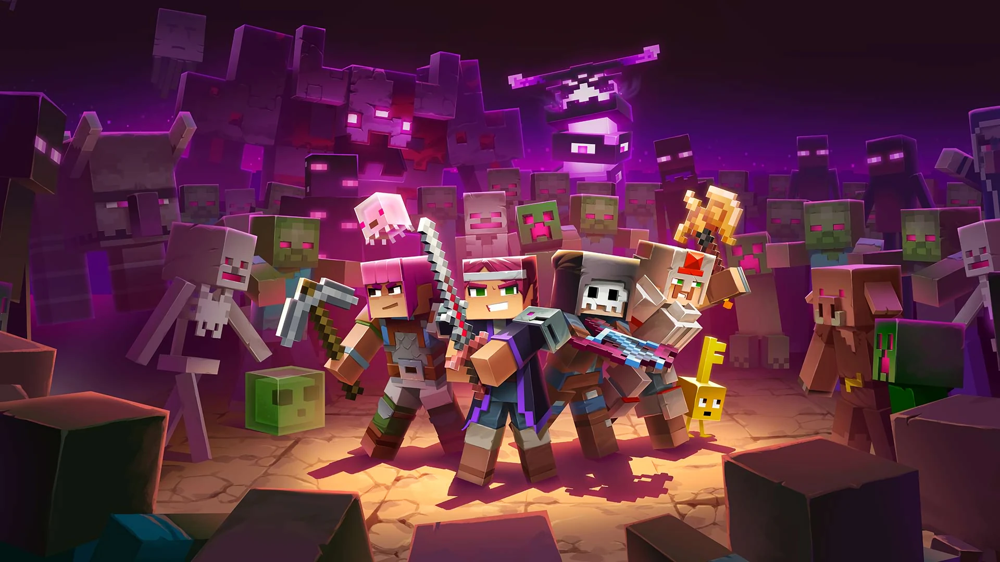

<div align="center">
  
  
  <h1>NovaCL</h1>
  
  <p align="center">
    <strong>Modern Minecraft Client Launcher</strong>
  </p>
  
  <div align="center">
    
    
    
    
    
  </div>

  <p></p>

  <div align="center">
    <a href="./README.md">
      
    </a>
    <a href="./docs/legal/EULA_EN.md">
      
    </a>
    <a href="./docs/legal/PRIVACY_POLICY_EN.md">
      
    </a>
  </div>
</div>

---

## 📖 Project Introduction

NovaCL is a modern Minecraft client launcher designed specifically for Minecraft players, providing convenient resource search, download, and management features. With a clean and intuitive interface, players can quickly browse, install, and update various mods, resource packs, and versions, while supporting multi-instance management for a smoother and more personalized gaming experience.

## ✨ Features

- 🔍 **Resource Search** - Support for Modrinth resource search
- 📥 **One-click Download** - Convenient resource download functionality
- 📦 **Version Management** - Support for multi-version resource management
- 🎨 **Modern UI** - Adopts modern interface design
- 🌙 **Dark Mode** - Support for light/dark theme switching
- ⚡ **High Performance** - Built on Tauri for excellent performance
- 📱 **Cross-platform** - Supports Windows, macOS, and Linux

## 🚀 Tech Stack

| Technology  | Version | Purpose                          |
| ----------- | ------- | -------------------------------- |
| Vue.js      | 3.5.13  | Frontend framework               |
| TypeScript  | 5.8.3   | Type safety                      |
| Tauri       | 2       | Cross-platform desktop framework |
| Rust        | 1.70+   | Backend development              |
| TailwindCSS | 4.1.4   | CSS framework                    |
| DaisyUI     | 5.0.27  | UI component library             |
| Pinia       | 3.0.2   | State management                 |
| Vue Router  | 4.5.1   | Routing management               |
| Vite        | 6.3.4   | Build tool                       |

## 📦 Installation

### Pre-built Versions

Visit the [Releases](https://github.com/NEXORA-Studios/Nova.CL/releases) page to download the latest version.

### Building from Source

#### Prerequisites

- [Node.js](https://nodejs.org/) 18+
- [Rust](https://www.rust-lang.org/) 1.70+
- [pnpm](https://pnpm.io/) or [bun](https://bun.sh/) (recommended)

#### Build Steps

```bash
# Clone the repository
git clone https://github.com/NEXORA-Studios/Nova.CL.git
cd Nova.CL

# Install dependencies
bun install

# Build the application
bun run tauri build
```

After building, the executable will be located in the `src-tauri/target/release/` directory.

## 💡 Usage

1. Launch the NovaCL application
2. Enter the name of the resource you want to find in the search box
3. Browse the search results and click to enter the resource details page
4. Select the appropriate version and click the download button
5. After downloading, the resource will be saved to the specified directory

## 🛠️ Development

### Development Environment Setup

```bash
# Install dependencies
bun install

# Start the development server
bun run tauri dev
```

### Project Structure

```
Nova.CL/
├── public/              # Static resources
├── src/                 # Vue frontend code
│   ├── assets/          # Frontend assets
│   ├── components/      # Vue components
│   ├── composables/     # Composables
│   ├── layout/          # Layout components
│   ├── modules/         # Modules
│   ├── pages/           # Page components
│   ├── types/           # TypeScript type definitions
│   ├── utils/           # Utility functions
│   ├── App.vue          # Root component
│   └── main.ts          # Entry file
├── src-tauri/           # Tauri backend code
│   ├── capabilities/    # Permission configuration
│   ├── icons/           # Application icons
│   ├── src/             # Rust source code
│   ├── Cargo.toml       # Rust dependency configuration
│   └── tauri.conf.json  # Tauri configuration file
├── package.json         # Node.js dependency configuration
├── tsconfig.json        # TypeScript configuration
└── vite.config.ts       # Vite configuration
```

## 🤝 Contributing

Contributions are welcome! Please submit Issues and Pull Requests.

## 📄 License

### Project Open Source License

This project is licensed under the AGPL 3.0 License - see the [LICENSE](LICENSE) file for details.

### End User License Agreement (EULA)

By using the NovaCL application, you agree to comply with our [End User License Agreement](docs/EULA_EN.md).

### Privacy Policy

We value your privacy. For details, please see our [Privacy Policy](docs/PRIVACY_POLICY_EN.md).

## 📞 Contact

- Project Address: [https://github.com/NEXORA-Studios/Nova.CL](https://github.com/NEXORA-Studios/Nova.CL)
- Issues: [https://github.com/NEXORA-Studios/Nova.CL/issues](https://github.com/NEXORA-Studios/Nova.CL/issues)

## 🙏 Acknowledgments

Thank you to all the developers and users who have contributed to this project!

<div align="center">
  <br>
  
  <br>
  <br>
  <p>Made with ❤️ for Minecraft players</p>
</div>
